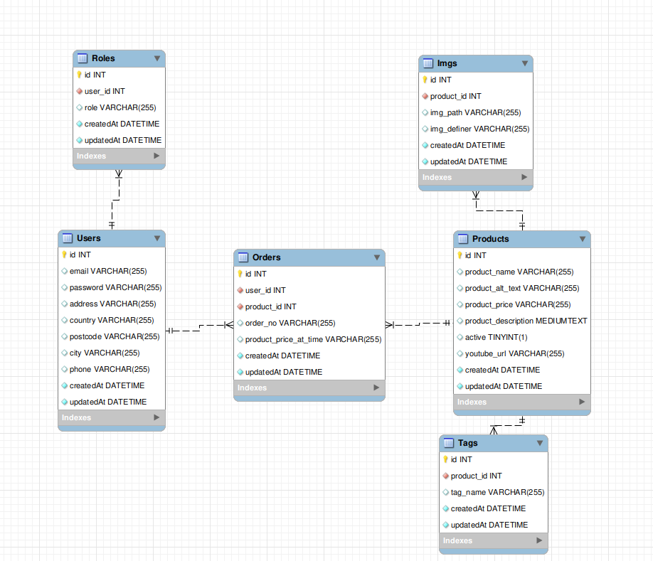

# Smart-Mart-Backend

<b>
👔GET👔SMART👔
</b>

Welcome to the Backend repo for my project: Smart Mart, the one stop shop for all things smart. 🔧

The database is a MySQL, that uses Sequelize as an ORM to establish the connection. The api's component is all handled through Express.js.

If you would like to see this in production, please direct yourself to the following repository -> https://github.com/gmluqa/Smart-Mart-Frontend

## Set-up for local deployment/development

Reqs: git, docker compose 🐳

Clone this repo: `git clone https://github.com/gmluqa/Smart-Mart-Backend.git`

Switch to the develop branch `git switch develop`.

Populate node_modules `npm i`

Modify the `./.env.example` to `./.env`

Spin the docker container `docker compose up`

Run `npm run db:init` to auto-dump the SQL into the docker container.

Then in another terminal, run `npm run dev` to launch the express server, connected to the develop db.

# Endpoints to probe

Check the tests folder for all avaliable endpoints, I reccomend installing the extension 'httpyac' on VS Code for the smoothest experience. 🏓

## API good practices employed

- If you check config/config.js, you'll see it's a .js file as opposed to a .json, this is to allow for no admin production keys to be uploaded to github (by default, sequelize serves it as a .json file)
- Not over-sharing DB info, only what is necesarry for the frontend
- Production API is using HTTPS to protect user JWT's
- HTTP status codes used in the correct context

# Credits

Have come to appreciate Sequelize as an ORM, once used to it, it is smooth sailing 🚣, I'd like to thank my tutors at GeeksHubs for giving me a foundation to grow as a software dev! 😍
